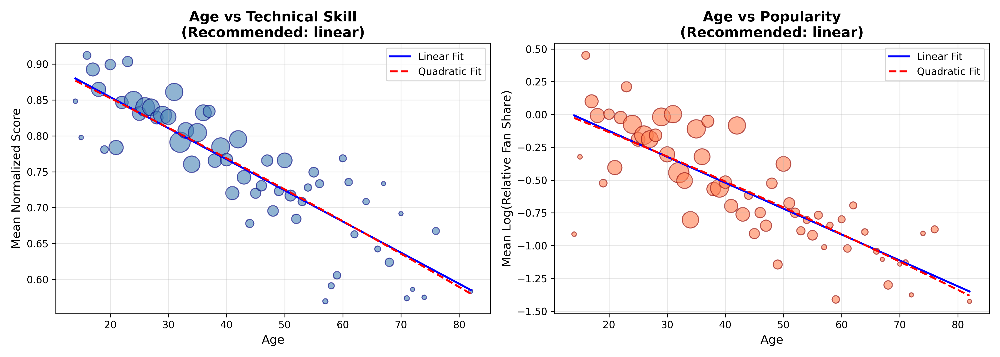
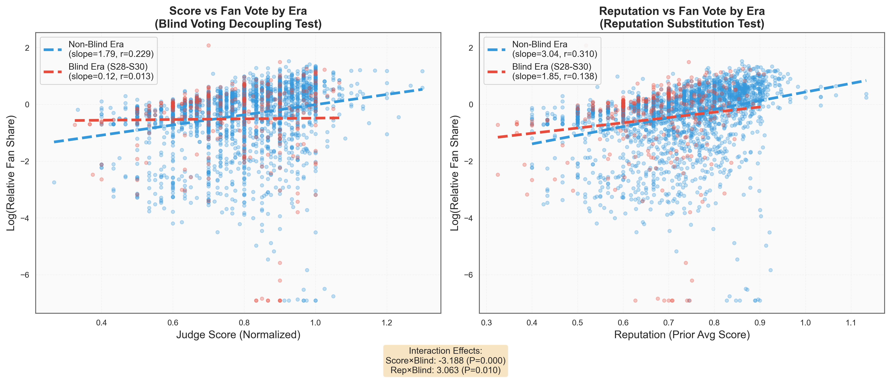

# Task 3: Factor Analysis Summary

## 研究问题

分析以下因素对选手表现的影响力：

1. **专业舞伴** (Professional Partner)
2. **明星特征**：年龄 (Age)、行业背景 (Industry)

---

## 方法论

### 1. 双轨归因模型 (Dual-Track Attribution Model)

将选手表现分解为两个独立赛道：

| 赛道                   | 因变量                    | 衡量内容                   |
| ---------------------- | ------------------------- | -------------------------- |
| **技术轨道 (Model A)** | `normalized_score`        | 评委评分（舞蹈技术水平）   |
| **人气轨道 (Model B)** | `log(relative_fan_share)` | 粉丝投票份额（观众喜爱度） |

### 2. 行业聚类 (K-Means Clustering)

**问题**：原始数据有26种职业，直接建模会导致过拟合。

**解决方案**：

- 为每种职业构建**三维评分**：Physicality（体能）、Performance（表演力）、Fanbase（粉丝基础）
- 使用K-Means聚类降维

**K值选择依据**：

| K     | Inertia (SSE) | Silhouette Score |
| ----- | ------------- | ---------------- |
| 2     | 48.91         | 0.4067           |
| **3** | 31.81         | **0.4595** ✓     |
| 4     | 19.44         | 0.4472           |
| 5     | 15.99         | 0.3916           |

**最优K=3**（轮廓系数最高，簇内紧密度与簇间分离度最佳）

### 3. 成长轨迹分析

对存活≥4周的选手拟合个体线性回归，计算技术成长斜率，再按行业簇进行ANOVA检验。

### 4. 年龄效应线性验证

在模型中使用线性年龄项前，需验证假设的合理性。通过比较线性模型与二次模型：

| 模型     | 线性LogLik | 二次LogLik | Age²系数 | Age² P值   | 推荐   |
| -------- | ---------- | ---------- | -------- | ---------- | ------ |
| 技术评分 | 1706.99    | 1703.13    | -0.0033  | **0.0892** | 线性 ✓ |
| 粉丝投票 | -4304.39   | -4307.50   | -0.0063  | **0.7029** | 线性 ✓ |

**结论**：两个模型的二次项P值均 > 0.05，线性假设成立。

### 5. 混合效应模型 (LMM)

使用专业舞伴作为随机效应，控制个体差异：

- **Model A**: `Score ~ Cluster + Week + Cluster×Week + Age + (1|Partner)`
- **Model B**: `log(FanShare) ~ Cluster + Score + Reputation + Age + (1|Partner)`

---

## 核心发现

### 1. 行业簇特征

| 簇名称                 | Physicality | Performance | Fanbase | 样本占比 | 典型职业                   |
| ---------------------- | ----------- | ----------- | ------- | -------- | -------------------------- |
| **Athletic Elite**     | 4.17        | 2.00        | 2.83    | 24.6%    | 运动员、奥运冠军、赛车手   |
| **Performance Artist** | 1.53        | 3.82        | 2.47    | 55.7%    | 演员、歌手、喜剧演员       |
| **Fan Favorite**       | 1.00        | 3.00        | 5.00    | 19.7%    | 真人秀明星、网红、选美冠军 |

### 2. 年龄线性验证结果

年龄对技术和人气的影响均为**线性关系**，无需引入二次项：

### 3. 技术轨道 (Model A) 结果

| 变量                                | 系数       | Std.Err | z值    | P值    | 显著性 |
| ----------------------------------- | ---------- | ------- | ------ | ------ | ------ |
| Intercept (Athletic Elite baseline) | 0.637      | 0.009   | 69.59  | <0.001 | \*\*\* |
| Fan Favorite                        | **-0.048** | 0.011   | -4.33  | <0.001 | \*\*\* |
| Performance Artist                  | 0.007      | 0.009   | 0.78   | 0.438  |        |
| Week                                | **+0.030** | 0.001   | 22.76  | <0.001 | \*\*\* |
| Fan Favorite × Week                 | **+0.004** | 0.002   | 2.11   | 0.035  | \*     |
| Performance Artist × Week           | 0.000      | 0.002   | 0.22   | 0.829  |        |
| Age (standardized)                  | **-0.044** | 0.002   | -19.79 | <0.001 | \*\*\* |

**解读**：

- 🏋️ **运动员优势**：Athletic Elite 起点最高（baseline）
- 📉 **粉丝型劣势**：Fan Favorite 技术评分低 4.8%
- 📈 **成长效应**：每周技术提升 3%
- 🚀 **追赶效应**：Fan Favorite 虽然起点低，但成长更快（+0.4%/周交互项显著）
- 👴 **年龄惩罚**：年龄每增加1个标准差，技术评分下降 4.4%

### 3. 人气轨道 (Model B) 结果

| 变量               | 系数       | Std.Err | z值    | P值    | 显著性 |
| ------------------ | ---------- | ------- | ------ | ------ | ------ |
| Intercept          | -1.957     | 0.162   | -12.07 | <0.001 | \*\*\* |
| Fan Favorite       | 0.048      | 0.066   | 0.73   | 0.465  |        |
| Performance Artist | 0.075      | 0.053   | 1.40   | 0.160  |        |
| Normalized Score   | **-0.998** | 0.246   | -4.05  | <0.001 | \*\*\* |
| Reputation         | **+3.155** | 0.324   | 9.75   | <0.001 | \*\*\* |
| Age (standardized) | **-0.182** | 0.025   | -7.24  | <0.001 | \*\*\* |

**解读**：

- 🌟 **名气主导**：初始名气 (reputation) 是最强预测因子（系数+3.16）
- ⚖️ **行业无差异**：行业簇对粉丝投票无显著影响（P>0.05）
- 🎭 **技术-人气悖论**：技术评分越高，粉丝投票反而越少（系数-1.0）
  - 可能解释：技术高的选手被认为"不需要帮助"，观众更愿意投给underdog
- 👴 **年龄惩罚加剧**：年龄对人气的负面影响是对技术的 **4倍** (-0.182 vs -0.044)

### 4. 专业舞伴效应 (Kingmaker Effect)

#### 技术提升 Top 3：

| 舞伴                  | 技术加成 |
| --------------------- | -------- |
| Derek Hough           | +0.075   |
| Artem Chigvintsev     | +0.055   |
| Valentin Chmerkovskiy | +0.042   |

#### 人气提升 Top 3：

| 舞伴                  | 人气加成 |
| --------------------- | -------- |
| Derek Hough           | +0.123   |
| Jenna Johnson         | +0.070   |
| Valentin Chmerkovskiy | +0.061   |

**Derek Hough 是唯一同时登顶技术+人气榜的"双料Kingmaker"**

### 5. 成长轨迹 ANOVA

| 簇                 | 平均成长斜率 | 标准差 | 样本数 |
| ------------------ | ------------ | ------ | ------ |
| Fan Favorite       | 0.0298       | 0.0173 | 66     |
| Athletic Elite     | 0.0270       | 0.0182 | 78     |
| Performance Artist | 0.0262       | 0.0194 | 182    |

**ANOVA结果**：F=0.91, P=0.404 → **不显著**

**结论**：不同行业背景的选手成长速度无统计学差异，所有人都在以相似的速率进步。

### 6. 盲投效应分析 (Blind Voting Effect)

#### 背景

"盲投"指西海岸观众因时区延迟（3小时），在未看到直播表演前就投票的现象。S28-S30 引入 Live Vote，但时区问题仍未解决。

#### 代理变量构造

- **D_Blind = 1**：Seasons 28, 29, 30（Live Vote 时代，西海岸仍有时差）
- **D_Blind = 0**：其他赛季（S1-S27 延时播出，S31+ 若有）

#### 模型公式

$$ Y*{Fan} = \alpha_0 + \alpha_1 Score + \mathbf{\alpha_2 (Score \times D*{Blind})} + \alpha*3 Rep + \mathbf{\alpha_4 (Rep \times D*{Blind})} + \sum \alpha*k Class_k + v*{Partner} $$

#### 相关性对比

| 时期                    | Score → FanVote | Reputation → FanVote | 样本数 |
| ----------------------- | --------------- | -------------------- | ------ |
| Non-Blind Era           | r = 0.229       | r = 0.310            | 2465   |
| **Blind Era (S28-S30)** | r = **0.013**   | r = 0.138            | 312    |

**观察**：盲投时期的 Score-Vote 相关性几乎为零！

#### 交互效应模型结果

| 参数                     | 系数       | Std.Err | P值          | 解读                   |
| ------------------------ | ---------- | ------- | ------------ | ---------------------- |
| α₁ (Score)               | -0.672     | 0.262   | 0.010\*\*    | 基准：分数高反而投票少 |
| **α₂ (Score × D_Blind)** | **-3.188** | 0.831   | **<0.001\*** | 🔥盲投脱钩             |
| α₃ (Reputation)          | +2.955     | 0.342   | <0.001\*\*\* | 声誉强烈驱动投票       |
| **α₄ (Rep × D_Blind)**   | **+3.063** | 1.192   | **0.010\***  | 🔥声誉替代             |

#### 核心发现

✅ **假设1验证：盲投脱钩效应**

- Score × D_Blind = **-3.19** (P<0.001)
- 盲投时期，当前表现对投票的影响**大幅削弱**
- 解读：观众投票时还没看到表演，只能依赖其他信息

✅ **假设2验证：声誉替代效应**

- Rep × D_Blind = **+3.06** (P=0.01)
- 盲投时期，历史声誉对投票的影响**显著增强**
- 解读：观众用"固有印象"替代当前表演来做决策

---

## 模型诊断

| 指标                | Model A (技术) | Model B (人气) |
| ------------------- | -------------- | -------------- |
| 观测数              | 2777           | 2777           |
| 随机效应组数 (舞伴) | 60             | 60             |
| 收敛状态            | ✓ Yes          | ✓ Yes          |
| Log-Likelihood      | 2489.1         | -4249.1        |
| 残差方差 (Scale)    | 0.0092         | 1.2368         |
| 随机效应方差        | 0.001          | 0.006          |

---

## 可视化产出

| 文件                         | 描述                             |
| ---------------------------- | -------------------------------- |
| `q3_optimal_k_selection.png` | K值选择：肘部法则 + 轮廓系数对比 |
| `q3_industry_clustering.png` | 行业聚类散点图 + 簇中心雷达图    |
| `q3_growth_trajectories.png` | 各簇成长曲线对比                 |
| `q3_age_linearity_test.png`  | 年龄线性 vs 二次拟合对比         |
| `q3_blind_voting_effect.png` | 盲投效应：评分-投票关系对比      |
| `q3_forest_plot.png`         | 双轨模型系数森林图               |
| `q3_partner_effects_v2.png`  | 舞伴随机效应排名                 |

---

## 关键结论

### 对选手的启示：

1. **年龄是双重劣势**：年龄越大，技术和人气都会受损，且对人气影响更大
2. **行业背景影响有限**：初始技术有差异，但成长潜力相似
3. **名气自带流量**：初始名气远比舞蹈表现更能预测粉丝投票

### 对节目组的启示：

1. **Derek Hough 是最佳资源**：应分配给潜力新星
2. **Underdog效应真实存在**：技术差的选手反而获得更多同情票
3. **粉丝型明星有成长潜力**：虽然起点低，但追赶速度更快

### 对赛制的启示：

技术评分与粉丝投票存在**负相关**，说明赛制设计有效平衡了专业判断与大众口味，避免了"技术独裁"或"流量霸权"。

---

## 模型文件

- **代码**：`src/factor_analysis_v2.py`
- **数据**：`results/question3/industry_codebook.csv`, `results/question3/growth_trajectories.csv`
- **详细报告**：`results/question3/q3_advanced_summary.md`
